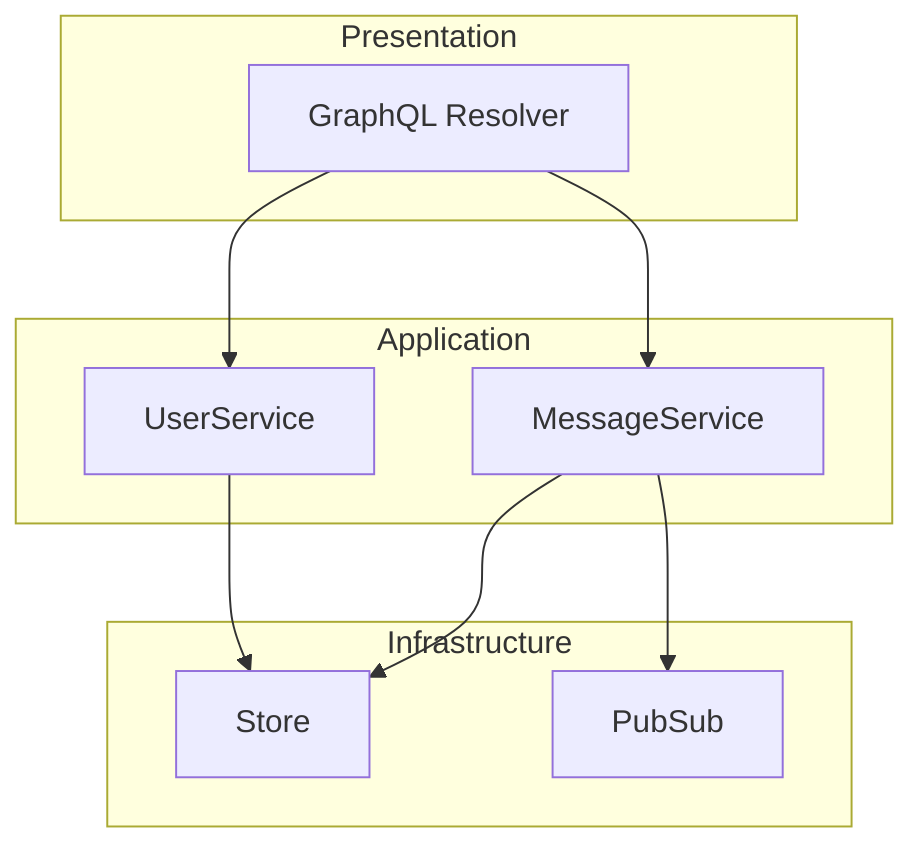
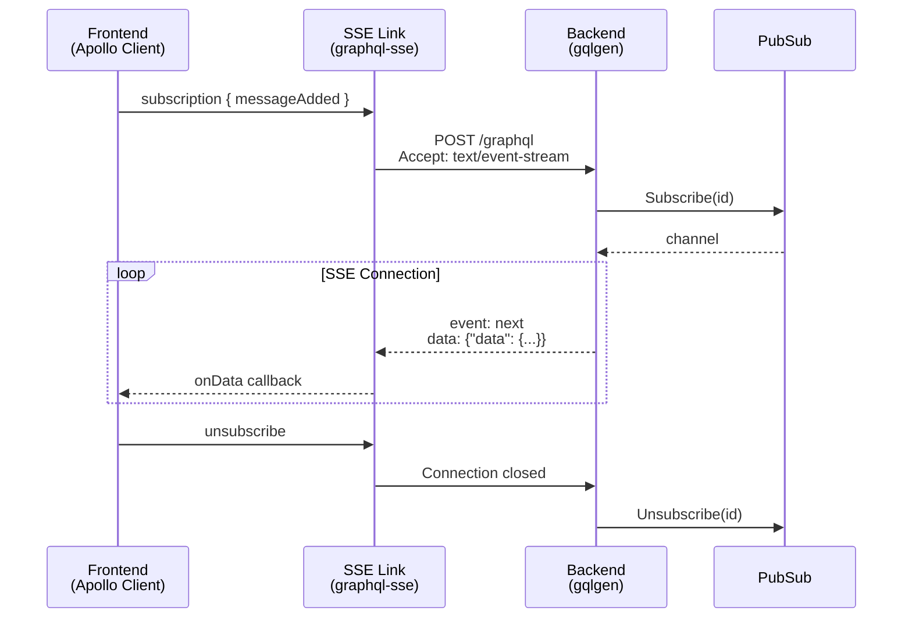
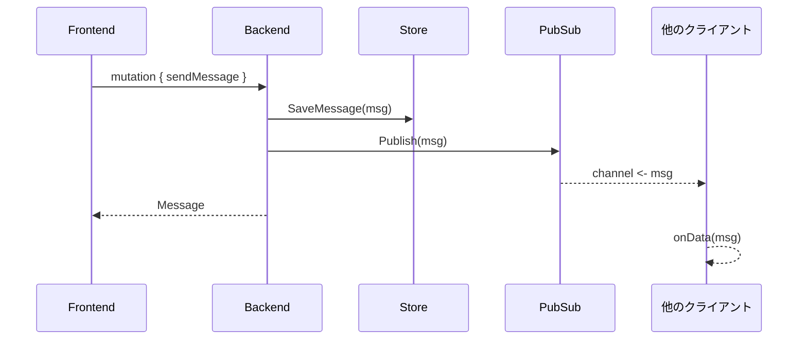
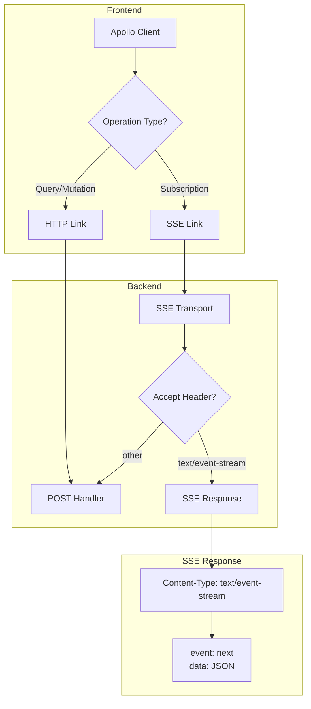
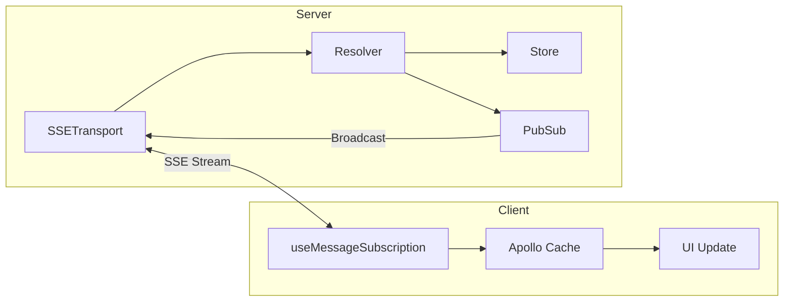

# GraphQL SSE Sample

GraphQL over Server-Sent Events (SSE) を使用したリアルタイムチャットアプリケーションのサンプルです。

## 技術スタック

| Layer | Technology |
|-------|------------|
| Frontend | React + Apollo Client + graphql-sse |
| Backend | Go + gqlgen |
| Protocol | GraphQL over SSE |

## アーキテクチャ

```
apps/
├── backend/           # Go GraphQL Server
│   ├── server/        # HTTPサーバー・SSEトランスポート
│   ├── graph/         # GraphQL スキーマ・リゾルバー
│   ├── service/       # ビジネスロジック層
│   ├── store/         # データストレージ層
│   ├── pubsub/        # Pub/Sub層
│   └── middleware/    # 認証・CORS
└── frontend/          # React Client
    ├── src/lib/       # Apollo Client設定
    └── src/features/  # 機能別モジュール
```

### レイヤー構成



| レイヤー | 責務 | 実装 |
|---------|------|------|
| Presentation | リクエスト/レスポンス変換 | graph/resolver |
| Application | ビジネスロジック | service/ |
| Infrastructure | 外部リソースアクセス | store/, pubsub/ |

## 処理の流れ

### Subscription（リアルタイム受信）



### メッセージ送信



### SSEトランスポート詳細



### データフロー



## セットアップ

```bash
# 依存関係のインストール
pnpm install

# バックエンド起動
cd apps/backend && go run .

# フロントエンド起動（別ターミナル）
cd apps/frontend && pnpm dev
```

## GraphQL スキーマ

```graphql
type Query {
  messages: [Message!]!
  me: User
}

type Mutation {
  login(nickname: String!): User!
  sendMessage(content: String!): Message!
}

type Subscription {
  messageAdded: Message!
}
```

## SSE vs WebSocket

| 特徴 | SSE | WebSocket |
|------|-----|-----------|
| 通信方向 | サーバー → クライアント | 双方向 |
| プロトコル | HTTP | 独自プロトコル |
| 再接続 | 自動 | 手動実装が必要 |
| ファイアウォール | 通過しやすい | ブロックされる場合あり |
| 実装難易度 | 低 | 中〜高 |

GraphQL Subscriptionのような「サーバーからのプッシュ」ユースケースでは、SSEがシンプルで実用的な選択肢です。
